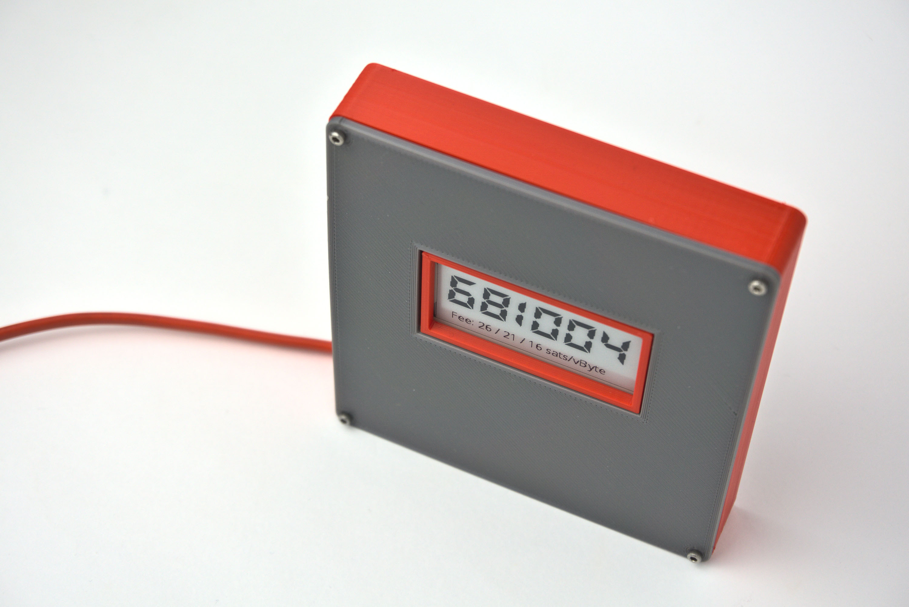

## bitblock 3d case Español

Esta es mi idea para lucir un **bitclock** en tu escritorio o dar personalidad a alguna de tus paredes. Es un diseño todavía en evolución, en el que puedes montar tu bitclock para ver el precio, altura de bloque y sats/byte actuales de la red de Bitcoin. 

**bitclock** es una idea de **Frangb**. Puedes ver cómo montar uno instalar uno en una Raspberry Zero WH en: 
* https://estudiobitcoin.com/como-construir-un-blockclock/
* and in github https://github.com/frangb/bitclock

Los diseños 3d se publican bajo licencia Creative Commons - Attribution - Non-Commercial - Sharealike

## bitblock 3d case English

This is the bitclock, a work in progress clock from in which you can check the price of bitcoin, the blockheight and the fee rate. It is the 3d printed case for **Frangb's** project. Full article on how to create a bitclock can be found at:
* https://estudiobitcoin.com/como-construir-un-blockclock/ 
* and in github https://github.com/frangb/bitclock

3d models files are published under Creative Commons - Attribution - Non-Commercial - Sharealike

## Tornillería/ Hardware:
Requires/Requiere:
* 6x M2 nuts/tuercas
* 2x M2-8mm screws / tornillos
* 2x M2-16mm screws / tornillos
* 2x M2-20mm screws  / tornillos
